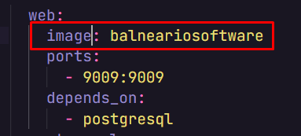
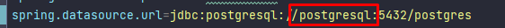

#Balneario Software
API criada para auxilizar balneários com cadastro de associados e suas carteirinhas, funcionários e reservas de locais

##Técnologias utilizadas
- Java
- Postgresql

## Pré-Requisitos
- Java 17
- Docker
- MVN

## Como executar
Para fazer o deploy da aplicação siga os seguintes passos:
Obs.: Passos executados em ambiente linux

1. Ao fazer o clone do projeto, dentro da pasta do mesmo, execute o comando `mvn clean install`
2. Ao término do processo, execute o comando `docker build -t {nome da imagem} .`
3. Neste repositório existe um arquivo chamado `docker-compose.yml` que é a imagem do docker para subirmos a aplicação
   - Dentro dele temos a imagem do programa ser executado
   
   - Caso tenho alterado o nome na hora do build, será necessário trocar aqui também
4. Depois de configurar todo o arquivo `docker-compose.yml` vá no seu terminal e de o comando `sudo docker-compose -f docker-compose.yml up` esse comando irá fazer com que suba 3 imagens no docker, o nosso software, o postgresql e o pgadmin
5. Com essas etapas já deve ser possivel utilizar a API

Obs.2: Caso altere o nome das imagens do postgres, no arquivo `application.properties` será necessário trocar o nome da conexão no seguinte atributo
